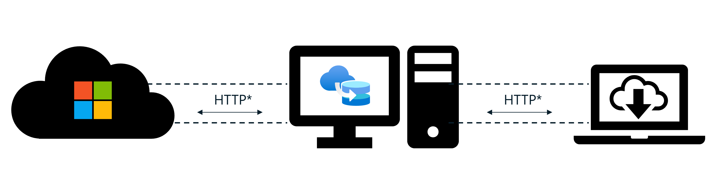

# Microsoft Connected Cache for Enterprise and Education Secure Content Delivery

This article describes how Connected Cache nodes facilitate secure delivery of Microsoft content between Microsoft/CDN endpoints and Delivery Optimization clients.

## How Connected Cache nodes facilitate secure content delivery

Connected Cache nodes act as transparent content caches, meaning any device can request Microsoft content from a Connected Cache node without needing to provide authentication of identity. This allows for efficient discovery and connectivity between devices and Connected Cache nodes on the same network.

Connected Cache nodes only download and store Microsoft content from provisioned Microsoft and CDN endpoints, so there are no concerns about the cache storing personal or sensitive data.

Regardless of download source, the Delivery Optimization client on each Windows device verifies the authenticity and integrity of content using its metadata hash, content hash, and signature before installing. This ensures that the Windows device is protected against man-in-the-middle attacks that may attempt to tamper with content while it's in transit.

As you can see in this diagram, Connected Cache nodes currently utilize HTTP to communicate with CDN endpoints and Delivery Optimization clients. There is work planned to support HTTPS communication between CDN endpoints and Delivery Optimization clients in the future.

## Security considerations for Connected Cache nodes

The security of each Connected Cache node is dependent on the security of the environment in which it's deployed.

In order to securely function as designed, Connected Cache expects the user to have taken steps to secure the different layers of their organization’s network and devices.

The following section is intended to provide a high-level overview of the security layers to be considered by the user, and additional resources for learning more.

### 1. Azure resources

The first layer of security lies with the Azure resources that your Microsoft Connected Cache nodes communicate with. You should ensure that your organization’s Azure tenant is using role-based access control (RBAC) to apply policies that enforce least-privilege access to the MCC Azure resources you have provisioned. Only trusted individuals should have the ability to perform create, read, update, and delete (CRUD) operations on your organization’s MCC Azure resources and cache nodes.

You can read more about [Azure identity management and access control security best practices](/azure/security/fundamentals/identity-management-best-practices) and the [Microsoft cloud security benchmark (MCSB) documentation for Identity management](/security/benchmark/azure/mcsb-network-security).

### 2. Local network

The second layer of security lies with your organization’s local network. It is recommended that your organization adopts a Zero Trust approach to network security so that your organizational data is protected even if an attacker breaches your network perimeter.

You can read more about [Azure best practices for network security](/azure/security/fundamentals/network-best-practices) and the [Microsoft cloud security benchmark (MCSB) documentation for Network security](/security/benchmark/azure/mcsb-network-security).

### 3. Cache node host machine OS

The third layer of security lies with the Operating System (OS) of your Connected Cache node’s host machine. When using Microsoft Connected Cache for Enterprise, your organization may choose to host Microsoft Connected Cache nodes on a [compatible host OS](mcc-ent-prerequisites.md) of your choice.

Regardless of which host OS you choose to use, you should ensure that it meets the recommendations of the Microsoft cloud security benchmark for [Windows](/azure/governance/policy/samples/guest-configuration-baseline-windows), [Linux](/azure/governance/policy/samples/guest-configuration-baseline-linux), and [Docker](/azure/governance/policy/samples/guest-configuration-baseline-docker) hosts and that you perform regular OS updates to keep it up to date.

If you are hosting on Windows, your host machine will use Windows Subsystem for Linux (WSL) to run the Connected Cache container. You should ensure that your deployment of WSL meets the [recommended Enterprise set up for WSL](/windows/wsl/enterprise).

### 4. Organization-managed Windows devices

The fourth and final layer of security lies with the organization-managed Windows devices that will be requesting Microsoft content from your Connected Cache nodes. The Windows devices that are connecting to the MCC node should be secured according to your organization’s security policy.

## Frequently asked questions

Below are some common questions you may have about the security of Microsoft Connected Cache for Enterprise and Education.

### How often is the Connected Cache container updated?

There are three scheduled MCC container updates per year. These updates included minor security patches, feature updates, and bug fixes.

In the event of a new Common Vulnerability and Exposure (CVE) being identified, Microsoft Connected Cache will publish a critical security patch to the MCC container in line with its SLA.

You can read more information about Connected Cache container updates in the [Connected Cache updating documentation](mcc-ent-update-cache-node.md).

### What security improvements are included in the latest Connected Cache container update?

You can find a list of security improvements and other fixes in the [Connected Cache release notes](mcc-ent-release-notes.md).

## Related content

- [Understand Windows Update security](/windows/deployment/update/windows-update-security)
- [Understand the Delivery Optimization secure workflow](delivery-optimization-workflow.md)
- [Understand delivery of Win32 apps via Intune](/troubleshoot/mem/intune/app-management/develop-deliver-working-win32-app-via-intune#the-flow-behind-delivery-of-a-win32-app-to-the-client)
- [Microsoft Win32 Content Prep Tool](https://github.com/Microsoft/Microsoft-Win32-Content-Prep-Tool)
