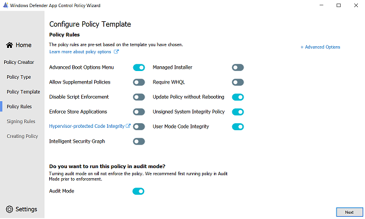
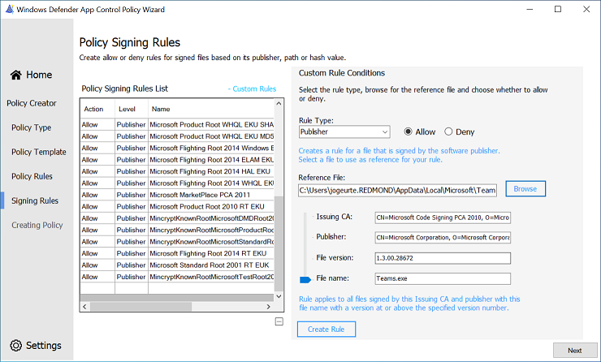

# Use the Smart App Control policy to build your starter policy

[!INCLUDE [Feature availability note](../includes/feature-availability-note.md)]

This article describes how to create an App Control for Business policy using the Smart App Control policy as a template. [Smart App Control](https://support.microsoft.com/topic/what-is-smart-app-control-285ea03d-fa88-4d56-882e-6698afdb7003) is an app control-based security solution designed for consumer users. It uses the same technology as App Control for Business so it's easy to use as the basis for an equally robust but flexible enterprise policy.

> [!TIP]
> Microsoft recommends the policy created in this article as the ideal starter policy for most App Control deployments to end users' devices. Typically, organizations new to App Control are most successful if they start with a permissive policy like the one described in this article. You can harden the policy over time to achieve a stronger overall security posture on your App Control-managed devices as described in later articles.

As we did in [App Control for Business deployment in different scenarios](common-appcontrol-use-cases.md), let's use the fictional example of **Lamna Healthcare Company (Lamna)** to illustrate this scenario. Lamna intends to adopt stronger application policies, including the use of App Control to prevent unwanted or unauthorized applications from running on their managed devices.

**Alice Pena (she/her)** is the IT team lead tasked with the rollout of App Control. Lamna currently has relaxed application usage policies and a culture of maximum app flexibility for users. So, Alice knows they need to take an incremental approach to App Control and likely use different policies for different user segments. But for now, Alice wants a policy that can cover most users without any modifications, Smart App Control's "Signed & Reputable" policy adapted for Lamna.

## Analyze how Smart App Control's "circle-of-trust" fits for you

Alice follows the guidance from the article [Plan for app control policy lifecycle management](./plan-appcontrol-management.md#policy-xml-lifecycle-management), and starts by analyzing the "circle-of-trust" for Smart App Control's policy. Alice reads Microsoft's online help articles about Smart App Control to understand it well. From that reading, Alice learns that Smart App Control allows only publicly trusted signed code or unsigned code that the [Intelligent Security Graph (ISG)](./use-appcontrol-with-intelligent-security-graph.md) predicts to be safe. Publicly trusted signed code means the signing certificate's issuer is one of the certificate authorities (CA) in Microsoft's Trusted Root Program. Unsigned code is blocked from running if the ISG can't predict that the code is safe to run. And code determined to be unsafe is always blocked.

Now Alice considers how to adapt the policy for Lamna's use. Alice wants to create an initial policy that is as relaxed as possible, but still provides durable security value. Some within Lamna advocate a more aggressive approach than Alice plans. They want to immediately lockdown end users' devices and hope for limited fallout. But the leadership team agrees with Alice that Lamna's app culture, formed slowly over time, won't just go away overnight and so the initial policy needs much flexibility.

### Consider the key factors about your organization

Alice next identifies the key factors about Lamna's environment that affect the company's "circle-of-trust." The policy must be flexible to meet the needs of the business in the short- and medium-term. That gives Lamna time to introduce new app management processes and policies to make it practical for a more restrictive app control policy in the future. The key factors also help Alice choose which systems to include in the first deployment. Alice writes down these factors in the planning document: 

- **User privileges:** Most users are standard user, but nearly a quarter have local admin rights on their devices and the option to run any app they choose is a major contributing factor.
- **Operating Systems:** Windows 11 runs most user devices, but Lamna expects ~10% of clients to remain on Windows 10 through the next fiscal year, particularly in smaller satellite offices. Lamna's servers and specialized equipment are out of scope at this time.
- **Client management:** Lamna uses Microsoft Intune for all Windows 11 devices, deployed as Microsoft Entra cloud-native. They continue to use Microsoft Endpoint Configuration Manager (MEMCM) for most Windows 10 devices, deployed as Microsoft Entra hybrid join.
- **App management:** Lamna has hundreds of line-of-business (LOB) apps across its business units. Alice's team deploys most, but not all, of these apps using Intune. And there's a long tail of apps used by smaller teams, including many "Shadow IT" apps, that have no official charter, but are critical to the employees who use them.
- **App development and code signing:** Lamna business units aren't standardized on development platforms and frameworks, so significant variability and complexity is likely. Almost all of the apps use unsigned, or mostly unsigned, code. Although the company now requires codesigning, Lamna's codesigning certificates come from its corporate Public Key Infrastructure (PKI), and require custom rules in the policy.

## Define the "circle-of-trust" for lightly managed devices

Based on these factors, Alice writes the pseudo-rules for the Lamna version of Microsoft's Signed & Reputable policy:

1. **"Windows and Microsoft-certified kernel drivers"** One or more signer rules allowing:
   - Windows and its components.
   - Kernel drivers signed by the Windows Hardware Quality Labs (WHQL) certificate authority.

2. **"Publicly-trusted signed code"** One or more signer rules allowing:
    - Code signed with certificates issued from any certificate authority participating in the [Microsoft Trusted Root Program ("AuthRoot")](/security/trusted-root/program-requirements) or non-OS code signed by Microsoft.

3. **Lamna signed code** One or more signer rules allowing:
    - Code signed by certificates issued from Lamna Codesigning private certificate authority (PCA), the intermediate cert issued from their own internal PKI.

4. **Allow apps based on their "reputation"** A policy option allowing:
    - Apps predicted to be "safe" by the ISG.

5. **Allow Managed Installer** A policy option allowing:
    - Code written to the system by a process designated by policy as a managed installer. For Lamna's managed installer policy, Alice includes the Intune Management Extension, and also well-known autoupdater processes for widely used apps. Alice also includes a filepath rule, "D:\ Lamna Helpdesk\*" where Lamna's helpdesk admins are trained to copy the app installers and scripts they use to repair user's apps and systems.

6. **Admin-only path rules** One or more filepath rules for the following locations:
   - "C:\Program Files\*"
   - "C:\Program Files (x86)\*"
   - "%windir%\*"
   - "D:\Lamna Helpdesk\*"

## Modify the "Signed & Reputable" policy template for your organization

Alice downloads the App Control Policy Wizard from https://aka.ms/appcontrolwizard and runs it.

1. On the **Welcome** page, Alice sees three options: **Policy Creator**, **Policy Editor**, and **Policy Merger**. Alice selects **Policy Creator** which takes her to the next page.

2. On **Select a Policy Type**, Alice must choose whether to create a *Multiple Policy Format* or *Single Policy Format* policy. Since all of the end users' devices run Windows 11 or current versions of Windows 10, Alice leaves the default *Multiple Policy Format*. Similarly, the choice between *Base Policy* and *Supplemental Policy* is straightforward and, here too, leaves the default *Base Policy* selected. Alice selects **Next** to continue.

3. The next page is where Alice will **Select a Base Template for the Policy**. The App Control Wizard offers three template policies to use when creating a new Base Policy. Each template policy applies slightly different rules to alter its circle-of-trust and security model of the policy. The three template policies are:

    

    | Template Base Policy | Description |
    |---------------------------------|-------------------------------------------------------------------|
    | **Default Windows mode**      | Default Windows mode authorizes the following components:  <ul><li>Windows operating system components - any binary installed by a fresh install of Windows</li><li>MSIX packaged apps signed by the Microsoft Store MarketPlace signer</li><li>Microsoft Office365 apps, OneDrive, and Microsoft Teams</li><li>[WHQL signed drivers](/windows-hardware/drivers/install/whql-release-signature)</li></ul>|
    | **Allow Microsoft mode**      | Allow Microsoft mode authorizes the following components:  <ul><li>All code allowed by Default Windows mode, plus...</li><li>*All Microsoft-signed software*</li></ul>|
    | **Signed and Reputable mode** | Signed and Reputable mode authorizes the following components:  <ul><li>All code allowed by Allow Microsoft mode, plus...<</li><li>*Files created or installed by a process configured as a [managed installer](./configure-authorized-apps-deployed-with-a-managed-installer.md)*</li><li>*Files with good reputation per [Microsoft Defender's Intelligent Security Graph technology](use-appcontrol-with-intelligent-security-graph.md)*</li></ul>|
    
      Alice selects the **Signed and Reputable mode** template and then **Next**, accepting the defaults for the policy filename and location.

4. On **Configure Policy Template - Policy rules**, Alice reviews the set of options enabled for the policy. The template already has most options set as recommended by Microsoft. The only changes Alice makes are to check the options for **Managed Installer** and **Require WHQL**. This way apps installed by Intune or any of the other managed installers are automatically allowed, and only kernel drivers built for Windows 10 or higher can run. Selecting **Next** advances the wizard.

    > [!div class="mx-imgBorder"]
    > 

5. The **File Rules** page shows the rules from the Signed and Reputable mode template policy. Alice adds the Signer rule to trust Lamna-signed code, and the filepath rules to allow code in admin-writable-only locations under the two Program Files directories, the Windows directory, and Lamna's Helpdesk folder. 

      To create each rule, Alice selects **+ Add Custom** which opens the **Custom Rules** dialog where the conditions for the rule are defined. For the first rule, the default selections for **Rule Scope** and **Rule Action** are correct. For the **Rule Type** dropdown, the **Publisher** option is the correct choice to create a Signer rule. Alice then selects **Browse** and picks a file signed by a cert issued by the Lamna Codesigning PCA. The Wizard shows the signature information and information pulled from the resource header section (RSRC) of the file, like ***product name*** and the ***original file name*** with checkboxes by each element. In this case, since they intend to allow everything signed with Lamna's internal codesigning certs, Alice leaves only ***Issuing CA*** and ***Publisher*** checked. With the rule conditions for the Lamna Codesigning PCA rule set, Alice selects **Create Rule** and sees the rule is included in the list. Alice repeats these steps for the rest of Lamna's custom rules.

    

6. Now that all of the edits described in the pseudo-rules are done, Alice selects **Next** and the wizard creates the App Control policy files. The output files include an XML form and a compiled binary form of the policy. Alice does a cursory review of the XML policy file to confirm the result looks good and then closes the wizard.

Alice uploads both files to a GitHub repository created specifically for Lamna's app control policy files.

Alice's starter policy is now ready to deploy in audit mode to Lamna's managed devices.

## Security considerations of this policy

In order to minimize the potential to negatively affect user productivity, Alice defined a policy that makes several trade-offs between security and user app flexibility. Some of the trade-offs include:

- **Users with administrative access**

  This trade-off is the most impactful security trade-off. It allows the device user, or malware running with the user's privileges, to modify or remove the App Control policy on the device. Additionally, administrators can configure any app to act as a managed installer, which would allow them to gain persistent app authorization for whatever apps or binaries they wish.

  Possible mitigations:

  - To prevent tampering of App Control policies, use signed App Control policies on systems running Unified Extensible Firmware Interface (UEFI) firmware.
  - To remove the need for trusting managed installer, create and deploy signed catalog files or deploy updated policies as part of your regular app deployment and app updating procedures.
  - To control access to other corporate resources and data, use the boot time measurement of App Control configuration state from the Trusted Computing Group (TCG) log with device attestation. 
  
- **Unsigned policies**

  Any process running as administrator can replace or remove unsigned policies without consequence. Similarly, unsigned supplemental policies can alter the "circle-of-trust" for an unsigned base policy that includes option **17 Enabled:Allow Supplemental Policies**.

  Possible mitigations:

  - To prevent tampering of App Control policies, use signed App Control policies on systems running UEFI firmware.
  - To minimize the risk, limit who can elevate to administrator on the device.

- **Managed installer**

  See [security considerations with managed installer](configure-authorized-apps-deployed-with-a-managed-installer.md#security-considerations-with-managed-installer)

  Possible mitigations:

  - To remove the need for trusting managed installer, create and deploy signed catalog files or deploy updated policies as part of your regular app deployment and app updating procedures.
  - To minimize the risk, limit who can elevate to administrator on the device.

- **Intelligent Security Graph (ISG)**

  See [security considerations with the Intelligent Security Graph](use-appcontrol-with-intelligent-security-graph.md#security-considerations-with-the-isg-option)

  Possible mitigations:

  - To remove the need for trusting ISG, perform a comprehensive audit of existing app usage and installation. Onboard any apps you find that aren't currently managed to your software distribution solution, like Microsoft Intune. Implement policies to require apps become managed by IT. Then transition from ISG to managed installer, signed catalog files and/or updated policy rules and deploy them as part of your regular app deployment and app updating procedures.
  - To collect more data for use in security incident investigations and post-incident reviews, deploy a highly restrictive app control policy in audit mode. The data captured in the App Control event logs contains useful information about all code that runs that isn't Windows signed. To prevent your policy from impacting your device performance and functionality, be sure it minimally allows Windows code that runs as part of the boot process.
 
- **Supplemental policies**

  Supplemental policies are designed to expand the "circle-of-trust" defined by the base policy. If the base policy is also unsigned, then any process running as administrator can place an unsigned supplemental policy and expand the "circle-of-trust" of the base policy without restriction.

  Possible mitigations:

  - Use signed App Control policies that allow authorized signed supplemental policies only.
  - Use a restrictive audit mode policy to audit app usage and augment vulnerability detection.

- **FilePath rules**

  See [more information about filepath rules](select-types-of-rules-to-create.md#more-information-about-filepath-rules)

  Possible mitigations:

  - Limit who can elevate to administrator on the device.
  - Transition from filepath rules to managed installer or signature-based rules.

- **Signed malware**

  Code signing alone isn't a security solution, but it does provide two critical building blocks that make security solutions like App Control possible. First, code signing strongly associates code with a real-world identity... and a real world identity can face consequences that a nameless, shadowy figure responsible for unsigned malware doesn't. Second, code signing provides cryptographic proof that the code running remains untampered since the publisher signed it. An app control policy that requires all code is signed, or the policy explicitly allows it, raises the stakes and the costs for an attacker. But there remain ways for a motivated attacker to get their malicious code signed and trusted, at least for a while. And even when software comes from a trustworthy source, it doesn't mean it's safe to run. Any code can expose powerful capabilities that a malicious actor could exploit for their own ill-intent. And vulnerabilities can turn the most benign code into something truly dangerous.

  Possible mitigations:

  - Use a reputable anti-malware or antivirus software with real-time protection, such as Microsoft Defender, to protect your devices from malicious files, adware, and other threats.

## What you should read next

- Learn more about managed installers: how they work, how to set them up, and what are their limitations in [Automatically allow apps deployed by a managed installer](./configure-authorized-apps-deployed-with-a-managed-installer.md).

- Learn how to deploy your starter policy and see it in action in [Deploying App Control for Business policies](../deployment/appcontrol-deployment-guide.md).
