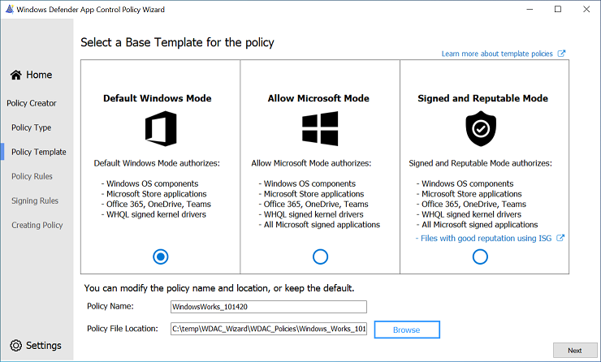

# Use the Smart App Control policy to build your starter policy

[!INCLUDE [Feature availability note](../includes/feature-availability-note.md)]

This article describes how to create an App Control for Business policy using the Smart App Control policy as a template. [Smart App Control](https://support.microsoft.com/topic/what-is-smart-app-control-285ea03d-fa88-4d56-882e-6698afdb7003) is an app control-based security solution designed for consumer users. It uses the same technology as App Control for Business so it's easy to use as the basis for an equally robust but flexible enterprise policy.

> [!TIP]
> Microsoft recommends the policy created in this article as the ideal starter policy for most App Control deployments to end users' devices. Typically, organizations new to App Control will be most successful if they start with a permissive policy like the one described in this article. You can harden the policy over time to achieve a stronger overall security posture on your App Control-managed devices as described in later articles.

As we did in [App Control for Business deployment in different scenarios](common-appcontrol-use-cases.md), we'll use the fictional example of **Lamna Healthcare Company (Lamna)** to illustrate this scenario. Lamna intends to adopt stronger application policies, including the use of App Control to prevent unwanted or unauthorized applications from running on their managed devices.

**Alice Pena** is the IT team lead tasked with the rollout of App Control. Lamna currently has relaxed application usage policies and a culture of maximum app flexibility for users. So, Alice knows she'll need to take an incremental approach to App Control and likely use different policies for different user segments. But for now, she wants to begin with a policy that can cover the vast majority of users without any modifications, Smart App Control's "Signed & Reputable" policy adapted for Lamna.

## Analyze how Smart App Control's "circle-of-trust" fits for you

Alice follows the guidance from the article [Plan for app control policy lifecycle management](./plan-appcontrol-management.md#policy-xml-lifecycle-management), and starts by analyzing the "circle-of-trust" for Smart App Control's policy. Alice reads Microsoft's online help articles about Smart App Control to be sure she understands it well. From her reading, she learns that Smart App Control allows only publicly-trusted signed code or unsigned code that the [Intelligent Security Graph (ISG)](./use-appcontrol-with-intelligent-security-graph.md) predicts is safe. Publicly-trusted signed code means the signing certificate was issued by one of the certificate authorities (CA) who are in Microsoft's Trusted Root Program. Unsigned code is blocked from running if the ISG can't predict that the code is safe to run. And code determined to be unsafe is always blocked.

Now Alice considers how to adapt the policy for Lamna's use. Alice wants to create an initial policy that is as relaxed as possible, but still provide durable security value. Alice knows that some within Lamna advocate a more aggressive approach than she plans. They want to immediately lockdown end users' devices and hope there's limited fallout. For now, she has support for her approach, because more of the leadership team agrees that the Lamna app culture that developed slowly over the course of the company's existence won't just go away overnight, so the policy must maintain substantial flexibility initially.

### Consider the key factors about your organization

Alice next identifies the key factors about Lamna's environment that she believes will most influence the company's "circle-of-trust". The policy must be flexible to meet the needs of the business in the short- and medium-term, while they introduce new app management processes that will make it practical to consider a more restrictive app control policy. The key factors also help her choose which systems to include in the first deployment. Alice writes down these factors in her planning worksheet so that whomever may follow her will know how she viewed the challenge:

- **User privileges:** Most users operate as standard user, though nearly a quarter still have local admin rights on their devices; the people with admin rights view the freedoms that gives them as essential, including the option to run whatever apps they want;
- **Operating Systems:** Windows 11 runs most user devices, but Windows 10 will remain on roughly 10% of clients at least through the next fiscal year, particularly those in smaller satellite offices; Alice's group doesn't manage Lamna's servers or any specialized equipment; Lamna's server IT group plans to wait to see how the client rollout of App Control unfolds before implementing the technology on the servers they control;
- **Client management:** Lamna uses Microsoft Intune for all Windows 11 devices, deployed as Microsoft Entra cloud-native; they continue to use Microsoft Endpoint Configuration Manager (MEMCM) with Microsoft Entra hybrid join on all Windows 10 devices;
- **App management:** Most, but not all, apps are deployed using Intune; there's a long tail of business-unit-specific apps, and "Shadow IT" apps that lack an official charter, but are critical to the employees who use them;
- **App development and code signing:** Lamna has hundreds of line-of-business (LOB) apps across its business units; Lamna hasn't aligned its business units on development platforms and frameworks, so Alice expects lots of variability and complexity; almost all of the apps use unsigned, or mostly unsigned, code; although the company has started to require codesigning, their codesigning certificates come from Lamna's corporate Public Key Infrastructure (PKI), so they aren't trusted by the Smart App Control policy by default; Alice must add the certs to the policy.

Based on the above, Alice defines the pseudo-rules for the Lamna version of Microsoft's Signed & Reputable policy:

1. **"Windows and Microsoft-certified kernel drivers"** One or more signer rules allowing:
   - Windows and its components.
   - Microsoft-certified third-party kernel drivers (WHQL).

2. **"Publicly-trusted signed code"** One or more signer rules allowing:
    - Code signed with certificates issued from any certificate authority participating in the [Microsoft Trusted Root Program ("AuthRoot")](/security/trusted-root/program-requirements) or non-OS code signed by Microsoft.

3. **Lamna signed code** One or more signer rules allowing:
    - Code signed by certificates issued from Lamna Codesigning PCA, the intermediate cert issued from their own internal PKI.

4. **Allow apps based on their "reputation"** A policy option allowing:
    - Apps predicted to be "safe" by the ISG.

5. **Allow Managed Installer** A policy option allowing:
    - Code written to the system by a process designated by policy as a managed installer. For Lamna's managed installer policy, Alice includes the Intune Management Extension, and also well-known auto-updater processes for widely-used apps. She also includes a filepath rule, "D:\ Lamna Helpdesk\*" where Lamna's helpdesk admins are trained to copy the app installers and scripts they use to repair user's apps and systems.

6. **Admin-only path rules** One or more filepath rules for the following locations:
   - "C:\Program Files\*"
   - "C:\Program Files (x86)\*"
   - "%windir%\*"
   - "D:\Lamna Helpdesk\*"

## Modify the "Signed & Reputable" policy template to suit your business needs

Alice is familiar with the App Control Policy Wizard, the open-source policy authoring UI maintained by the team responsible for App Control for Business and Smart App Control. She downloads the tool from its official [download site](https://aka.ms/appcontrolwizard) and runs it.

1. On the **App Control Policy Wizard's** welcome page, Alice sees three options: **Policy Creator**, **Policy Editor**, and **Policy Merger**. Alice selects **Policy Creator** which takes her to the next page.

2. On **Select a Policy Type**, Alice must choose whether to create a *Multiple Policy Format* or *Single Policy Format* policy. Since all of the end users' devices run Windows 11 or current versions of Windows 10, she takes the default *Multiple Policy Format*. Similarly, the choice between *Base Policy* and *Supplemental Policy* is straightforward and, here too, she leaves the default, *Base Policy* intact. She selects **Next** to continue.

3. The next page is where Alice will **Select a Base Template for the Policy**. The App Control Wizard offers three template policies to use when creating a new Base Policy. Each template policy applies slightly different rules to alter its circle-of-trust and security model of the policy. The three template policies are:

    | Template Base Policy | Description |
    |---------------------------------|-------------------------------------------------------------------|
    | **Default Windows mode**      | Default Windows mode authorizes the following components: </br><ul><li>Windows operating system components - any binary installed by a fresh install of Windows</li><li>Packaged apps (MSIX) signed by the Microsoft Store MarketPlace signer</li><li>Microsoft Office365 apps, OneDrive, and Microsoft Teams</li><li>Third-party [Windows Hardware Compatible drivers](/windows-hardware/drivers/install/whql-release-signature)</li></ul>|
    | **Allow Microsoft mode**      | Allow Microsoft mode authorizes the following components: </br><ul><li>All code allowed by Default Windows mode, plus...</li><li>*All Microsoft-signed software*</li></ul>|
    | **Signed and Reputable mode** | Signed and Reputable mode authorizes the following components: </br><ul><li>All code allowed by Allow Microsoft mode, plus...<</li><li>*Files created or installed by a process configured as a [managed installer](./configure-authorized-apps-deployed-with-a-managed-installer.md)*</li><li>*Files with good reputation per [Microsoft Defender's Intelligent Security Graph technology](use-appcontrol-with-intelligent-security-graph.md)*</li></ul>|
    
      Alice selects the **Signed and Reputable mode** template and then **Next**, accepting the defaults for the policy filename and location.

4. On the **Configure Policy Template - Policy rules** page, Alice reviews the set of options enabled for the policy. She's pleased to see the template already has most options set as recommended by Microsoft. The only changes she makes are to check the options for **Managed Installer** and **Require WHQL**. This way apps installed by Intune or any of the other managed installers are automatically allowed, and only kernel drivers built for Windows 10 or higher will run. Then she selects **Next**.

5. On the **File Rules** page, Alice sees the rules Microsoft included in the Signed and Reputable mode template policy. Here, she'll add the Signer rule to trust Lamna-signed code, and the filepath rules to allow code in admin-writable-only locations under the two Program Files directories, the Windows directory, and Lamna's Helpdesk folder. 

      To create each rule, Alice selects **+ Add Custom** which opens the **Custom Rules** dialog where the conditions for the rule are defined. For the first rule, she leaves the default selections for **Rule Scope** and **Rule Action**. For the **Rule Type** dropdown, she chooses the **Publisher** option to create a Signer rule. She then selects **Browse** to choose a file she knows is signed by a cert chaining up to the Lamna Codesigning PCA. The Wizard shows the signature information it found on the file with checkboxes for each element of the signature and the file's signed .rsrc header section, including Product Name and Original File Name. In this case, since she intends to allow everything signed with Lamna's interal codesigning certs, she only leaves Issuing CA and Publisher checked. Having set the rule conditions for the Lamna Codesigning PCA rule, she selects **Create Rule** and sees that the rule is now shown in the list.

      Alice repeats the preceding steps to create the rest of the rules. choose whether to allow or block based on it.  adds rules to e. For this reason, the Prerequisite information about App Control can be accessed through the [App Control design guide](appcontrol-design-guide.md). This page outlines the steps to create a new App Control policy from a template, configure the policy options, and the signer and file rules.

## Template Base Policies

 The following table lists the policies in increasing order of trust and freedom. For instance, the Default Windows mode policy trusts fewer application publishers and signers than the Signed and Reputable mode policy. The Default Windows policy has a smaller circle-of-trust with better security than the Signed and Reputable policy, but at the expense of compatibility.

, she immediately notices the template called **Signed and Reputable Mode** and reads the list of code the template authorizes, which perfectly matches the "circle-of-trust" for Smart App Control. Alice selects the template and selects **Next** to see the policy rules set by the template.


*Italicized content denotes the changes in the current policy with respect to the policy prior.*

More information about the Default Windows Mode and Allow Microsoft Mode policies can be accessed through the [Example App Control for Business base policies article](example-appcontrol-base-policies.md).



Once the base template is selected, give the policy a name and choose where to save the App Control policy on disk.

## Create a custom base policy using an example App Control base policy

Having defined the "circle-of-trust", Alice is ready to generate the initial policy for Lamna's lightly managed devices. Alice decides to use the example `SmartAppControl.xml` to create the initial base policy and then customize it to meet Lamna's needs.

Alice follows these steps to complete this task:

1. On a client device, run the following commands in an elevated Windows PowerShell session to initialize variables:

    > [!NOTE]
    > If you prefer to use a different [example App Control for Business base policy](example-appcontrol-base-policies.md), substitute the example policy path with your preferred base policy in this step.

    ```powershell
    $PolicyPath = $env:userprofile+"\Desktop\"
    $PolicyName= "Lamna_LightlyManagedClients_Audit"
    $LamnaPolicy=Join-Path $PolicyPath "$PolicyName.xml"
    $ExamplePolicy=$env:windir+"\schemas\CodeIntegrity\ExamplePolicies\SmartAppControl.xml"
    ```

1. Copy the example policy to the desktop:

    ```powershell
    Copy-Item $ExamplePolicy $LamnaPolicy
    ```

1. Modify the policy to remove unsupported rule:

    > [!NOTE]
    > `SmartAppControl.xml` is available on Windows 11 version 22H2 and later. This policy includes "Enabled:Conditional Windows Lockdown Policy" rule that is unsupported for enterprise App Control policies and must be removed. For more information, see [App Control and Smart App Control](../appcontrol.md#app-control-and-smart-app-control). If you are using an example policy other than `SmartAppControl.xml`, skip this step.

    ```powershell
    [xml]$xml = Get-Content $LamnaPolicy
    $ns = New-Object System.Xml.XmlNamespaceManager($xml.NameTable)
    $ns.AddNamespace("ns", $xml.DocumentElement.NamespaceURI)
    $node = $xml.SelectSingleNode("//ns:Rules/ns:Rule[ns:Option[.='Enabled:Conditional Windows Lockdown Policy']]", $ns)
    $node.ParentNode.RemoveChild($node)
    $xml.Save($LamnaPolicy)
    ```

1. Give the new policy a unique ID, descriptive name, and initial version number:

    ```powershell
    Set-CIPolicyIdInfo -FilePath $LamnaPolicy -PolicyName $PolicyName -ResetPolicyID
    Set-CIPolicyVersion -FilePath $LamnaPolicy -Version "1.0.0.0"
    ```

1. [Use Configuration Manager to create and deploy an audit policy](/configmgr/protect/deploy-use/use-device-guard-with-configuration-manager) to the client device running Windows 10 version 1903 and above, or Windows 11. Merge the Configuration Manager policy with the example policy.

    > [!NOTE]
    > If you do not use Configuration Manager, skip this step.

    ```powershell
    $ConfigMgrPolicy=$env:windir+"\CCM\DeviceGuard\MergedPolicy_Audit_ISG.xml"
    Merge-CIPolicy -OutputFilePath $LamnaPolicy -PolicyPaths $LamnaPolicy,$ConfigMgrPolicy
    Set-RuleOption -FilePath $LamnaPolicy -Option 13 # Managed Installer
    ```

1. Modify the policy to set additional policy rules:

    ```powershell
    Set-RuleOption -FilePath $LamnaPolicy -Option 3  # Audit Mode
    Set-RuleOption -FilePath $LamnaPolicy -Option 12 # Enforce Store Apps
    Set-RuleOption -FilePath $LamnaPolicy -Option 19 # Dynamic Code Security
    ```

1. Add rules to allow the Windows and Program Files directories:

    ```powershell
    $PathRules += New-CIPolicyRule -FilePathRule "%windir%\*"
    $PathRules += New-CIPolicyRule -FilePathRule "%OSDrive%\Program Files\*"
    $PathRules += New-CIPolicyRule -FilePathRule "%OSDrive%\Program Files (x86)\*"
    Merge-CIPolicy -OutputFilePath $LamnaPolicy -PolicyPaths $LamnaPolicy -Rules $PathRules
    ```

1. If appropriate, add more signer or file rules to further customize the policy for your organization.

1. Use [ConvertFrom-CIPolicy](/powershell/module/configci/convertfrom-cipolicy) to convert the App Control for Business policy to a binary format:

    ```powershell
    [xml]$PolicyXML = Get-Content $LamnaPolicy
    $LamnaPolicyBin = Join-Path $PolicyPath "$($PolicyXML.SiPolicy.PolicyID).cip"
    ConvertFrom-CIPolicy $LamnaPolicy $LamnaPolicyBin
    ```

1. Upload your base policy XML and the associated binary to a source control solution, such as [GitHub](https://github.com/) or a document management solution such as [Office 365 SharePoint](https://products.office.com/sharepoint/collaboration).

At this point, Alice now has an initial policy that is ready to deploy in audit mode to the managed clients within Lamna.

## Security considerations of this lightly managed policy

In order to minimize user productivity impact, Alice has defined a policy that makes several trade-offs between security and user app flexibility. Some of the trade-offs include:

- **Users with administrative access**

  This trade-off is the most impactful security trade-off. It allows the device user, or malware running with the user's privileges, to modify or remove the App Control policy on the device. Additionally, administrators can configure any app to act as a managed installer, which would allow them to gain persistent app authorization for whatever apps or binaries they wish.

  Possible mitigations:

  - Use signed App Control policies and UEFI BIOS access protection to prevent tampering of App Control policies.
  - To remove the requirement for managed installer, create and deploy signed catalog files as part of the app deployment process.
  - Use device attestation to detect the configuration state of App Control at boot time and use that information to condition access to sensitive corporate resources.

- **Unsigned policies**

  Unsigned policies can be replaced or removed without consequence by any process running as administrator. Unsigned base policies that also enable supplemental policies can have their "circle-of-trust" altered by any unsigned supplemental policy.

  Possible mitigations:

  - Use signed App Control policies and UEFI BIOS access protection to prevent tampering of App Control policies.
  - Limit who can elevate to administrator on the device.

- **Managed installer**

  See [security considerations with managed installer](configure-authorized-apps-deployed-with-a-managed-installer.md#security-considerations-with-managed-installer)

  Possible mitigations:

  - To remove the requirement for managed installer, create and deploy signed catalog files as part of the app deployment process.
  - Limit who can elevate to administrator on the device.

- **Intelligent Security Graph (ISG)**

  See [security considerations with the Intelligent Security Graph](use-appcontrol-with-intelligent-security-graph.md#security-considerations-with-the-isg-option)

  Possible mitigations:

  - Implement policies that require apps be managed by IT. Audit existing app usage and deploy authorized apps using a software distribution solution, like Microsoft Intune. Move from ISG to managed installer or signature-based rules.
  - Use a restrictive audit mode policy to audit app usage and augment vulnerability detection.

- **Supplemental policies**

  Supplemental policies are designed to relax the associated base policy. Additionally allowing unsigned policies allows any administrator process to expand the "circle-of-trust" defined by the base policy without restriction.

  Possible mitigations:

  - Use signed App Control policies that allow authorized signed supplemental policies only.
  - Use a restrictive audit mode policy to audit app usage and augment vulnerability detection.

- **FilePath rules**

  See [more information about filepath rules](select-types-of-rules-to-create.md#more-information-about-filepath-rules)

  Possible mitigations:

  - Limit who can elevate to administrator on the device.
  - Migrate from filepath rules to managed installer or signature-based rules.

- **Signed files**

  Although files that are code-signed verify the author's identity and ensures that the code hasn't been altered by anyone other than the author, it doesn't guarantee that the signed code is safe.

  Possible mitigations:

  - Use a reputable antimalware or antivirus software with real-time protection, such as Microsoft Defender, to protect your devices from malicious files, adware, and other threats.

## Up next

- [Create an App Control for Business policy for fully managed devices](create-appcontrol-policy-for-fully-managed-devices.md)
- [Prepare to deploy App Control for Business policies](../deployment/appcontrol-deployment-guide.md)
